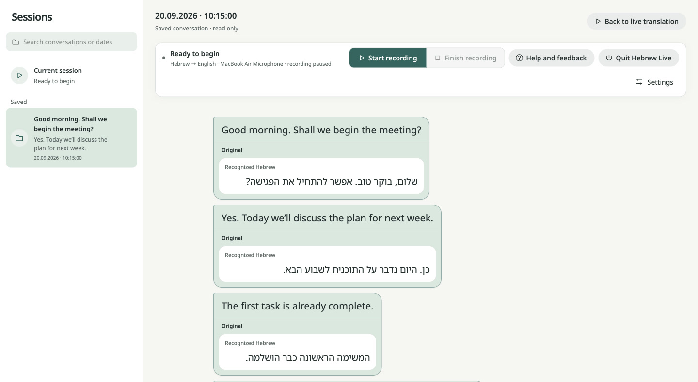
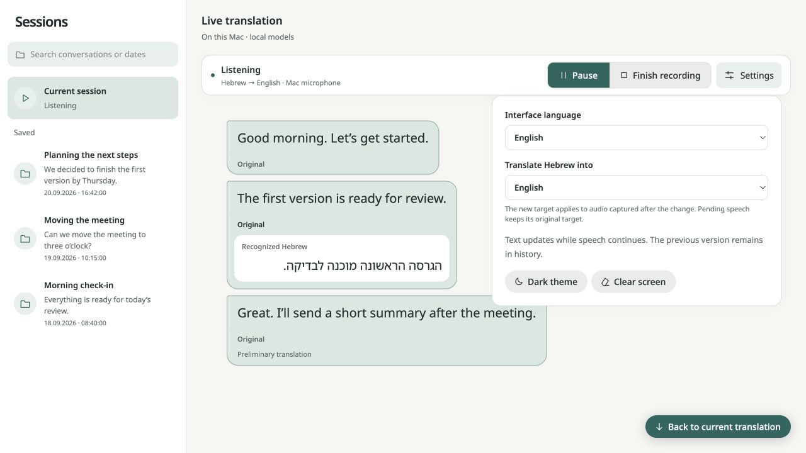
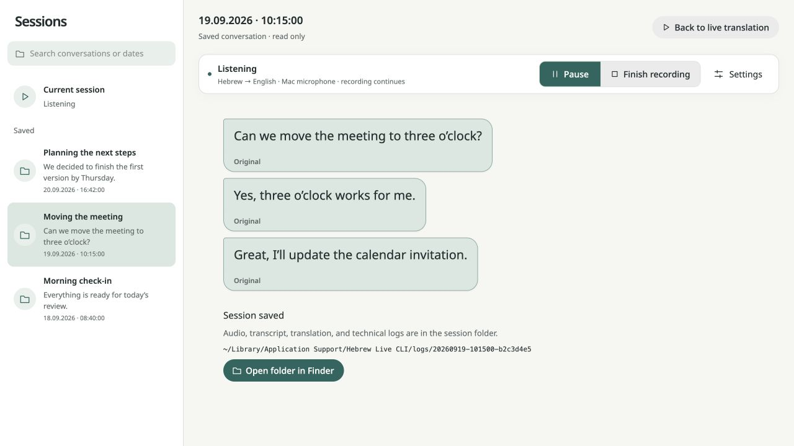

# Hebrew Live CLI

[](https://github.com/igor-markin/hebrew-live/actions/workflows/ci.yml)
[](#supported-alpha-contract)
[](https://github.com/ml-explore/mlx)
[](LICENSE)

[Русская версия](README.ru.md)

Hebrew Live transcribes spoken Hebrew with
[ivrit.ai Whisper Large v3 Turbo](https://huggingface.co/mlx-community/ivrit-ai-whisper-large-v3-turbo-mlx)
and translates it into your selected language with
[MiLMMT-46-4B](https://huggingface.co/translate-studio/MiLMMT-46-4B-v1.0-4bit-MLX).
Both models run locally in MLX format on Apple Silicon's Metal GPU. After the initial
setup, your audio, transcripts, translations, session history, and the browser UI stay
on your Mac.

**Runtime support is Apple Silicon only.** ASR and translation run through MLX on the
Mac's Metal GPU. The Python coordinator and Silero VAD also use the CPU; this is not a
claim that every operation runs on the GPU. There is no Intel, Rosetta, Linux, Docker,
CPU-inference, CUDA, or cloud fallback.



*Production browser UI with synthetic demonstration text.*

This repository is a **public-alpha prerelease**, not a stable release. Its original
code is licensed under [Apache License 2.0](LICENSE). That license does not cover model
weights, fonts, or other third-party material. Do not call it production-ready
until the separate reviews in [Third-party software and models](docs/THIRD_PARTY.md)
and [Release readiness](docs/RELEASE_READINESS.md) are complete.

## What the alpha does

- captures a microphone or replays a local audio file;
- recognizes Hebrew and translates it into a target supported by the active local
  translation model; an optional upstream multilingual Whisper remains an unqualified
  ASR backend rather than a broader product input contract;
- shows a revisable live draft in a loopback-only browser UI;
- stores original audio, transcripts, translations, and diagnostic events locally;
- keeps completed sessions available for local review and explicit deletion;
- never falls back to a cloud inference service.

Draft text can change as more speech arrives. A displayed translation is not a
certified transcript, a human translation, or a safe basis for medical, legal,
financial, or emergency decisions.

## Supported alpha contract

The declared target is an **Apple Silicon (`arm64`) Mac running natively**, a currently
supported macOS release, and **CPython 3.12.x**. The launcher checks macOS, native arm64,
and actual MLX access to Metal before model download or model loading. An input
microphone is required for `listen`.
The browser UI needs a current browser with JavaScript, `ResizeObserver`,
`MutationObserver`, and loopback HTTP support. Safari and Chromium are intended
targets; a formal browser/version matrix has not yet been qualified.

The current development validation host is macOS 27.0 on arm64. A real clean-Mac
trial remains a release blocker, so this is evidence about one host, not a minimum
macOS claim. Node.js 24 and npm are needed only to rebuild or test the bundled UI;
ordinary source or wheel users receive prebuilt UI assets.

Other operating systems, Intel Macs, Rosetta terminals, Python 3.13+, browser
extensions that block loopback requests, and remote/browser-server deployments are
outside this alpha contract.

## GitHub and clean-source quickstart

Install [`uv`](https://docs.astral.sh/uv/), then clone the repository and run the
launcher in an interactive Terminal:

```sh
git clone https://github.com/igor-markin/hebrew-live.git
cd hebrew-live
./run.sh
```

For an allowlisted source bundle, unpack it and run `./run.sh` from its root instead.

On the first run, the launcher asks before `uv` acquires Python 3.12 or installs the
frozen dependencies, checks the supported platform and Metal device, prints the model
sources and linked terms, and asks separately before the approximately 5.1 GB default
model download. A refusal or end-of-input stops without downloading weights. Later
runs use the prepared environment in offline mode and open the embedded browser UI.
The launcher does not install `uv`, Homebrew, or other system software.

For an unattended first run, review [the model inventory and
terms](docs/THIRD_PARTY.md) first, then use the explicit one-command form:

```sh
./run.sh --accept-model-terms
```

Passing this flag explicitly acknowledges that the user reviewed the linked model
sources and terms and requests the download. It prepares the frozen environment,
downloads the pinned default models, and starts `listen`; it does not change upstream
terms or save a separate legal-acceptance record. Without a terminal or that flag,
first-run model setup stops.

The individual commands remain available for inspection and recovery:

```sh
./run.sh model-info
./run.sh languages
./run.sh setup --accept-model-terms
./run.sh doctor
./run.sh listen
```

`model-info` itself downloads no weights and is also available as `he-ru model-info`
from an installed wheel. Setup downloads pinned revisions and creates a local SHA-256
manifest. The managed translation model is MiLMMT; setup has no alternate translator
download.

The estimates are the current local file sizes; network transfer and temporary disk
use can differ. Model files are not included in the source archive, sdist, or wheel.
Before downloading, `setup` repeats each source, terms/evidence link, and review note.
The acknowledgement flag is only an accidental-download guard; it does not make a
legal determination or create an acceptance record.

You may instead supply all three compatible local components and skip `setup`:

```sh
./run.sh doctor \
  --asr-model /absolute/path/to/mlx-whisper \
  --translation-model /absolute/path/to/mlx-lm \
  --vad-model /absolute/path/to/silero-vad.onnx
./run.sh listen \
  --asr-model /absolute/path/to/mlx-whisper \
  --translation-model /absolute/path/to/mlx-lm \
  --vad-model /absolute/path/to/silero-vad.onnx
```

This is a narrow compatibility hook, not arbitrary model support. ASR must be an
MLX Whisper directory containing `config.json` and `weights.safetensors`. Translation
must be an MLX-LM directory with config, tokenizer, and safetensors files and must
match the MiLMMT plain-prompt and tokenizer contract. VAD must expose the same ONNX
interface as Silero VAD. `doctor` is the only
compatibility test; architecture, language quality, or safety are not inferred from a
matching directory layout. Explicit paths must be outside the setup-managed `models/`
directory, so they cannot bypass its SHA-256 manifest. If only some components are
custom, the entire managed manifest is still verified. Runtime model switching is
disabled whenever an explicit path is used. For a custom translator, the target menu
is the MiLMMT contract's allowlist; it is not evidence that the supplied
weights were trained or quality-tested for every listed language.

Dependency bootstrap and `setup` use the network. `run.sh` sets model runtimes to
offline mode for every other command and keeps `uv` offline after the environment is
prepared. The browser UI loads fonts and scripts from the installed package and listens
only on `127.0.0.1` behind a random per-process URL.

Every launch first runs the read-only `uv sync --frozen --offline --check`. A Python
executable left behind by an interrupted sync is not considered ready. If the managed
project environment is incomplete or no longer matches `pyproject.toml` and `uv.lock`, an interactive run asks
before repairing it. For an intentional noninteractive dependency repair use, for
example, `./run.sh --bootstrap model-info`; `--bootstrap` never acknowledges model terms
or downloads weights. A failed repair keeps its original exit status, and the next run
requires consent again.

## Package build and install

The distribution strategy for the alpha is an allowlisted source archive plus normal
Python wheel/sdist artifacts. `run.sh` ships in the source export and sdist. A wheel
installation instead exposes the `he-ru` command from its already-created Python
environment; the same runtime platform and Metal guard still applies. Homebrew
formulae, a GUI installer, code signing, and upload to a package index are outside this
slice.

A package index is not required for installation. `uv tool install` accepts a local
project directory or a Git package source and creates a persistent isolated tool
environment. From a reviewed local checkout:

```sh
uv tool install --python 3.12 /absolute/path/to/hebrew-live
he-ru model-info
he-ru setup --accept-model-terms
he-ru doctor
```

The dedicated repository is
[github.com/igor-markin/hebrew-live](https://github.com/igor-markin/hebrew-live).
The source is published there. A normal wheel or Git install resolves the package's
exact direct runtime dependencies. For a reproducible VCS install, pin the full commit
SHA that you reviewed for both the source and its complete transitive constraints:

```sh
uv tool install --python 3.12 \
  --constraints 'https://raw.githubusercontent.com/igor-markin/hebrew-live/COMMIT_SHA/constraints.txt' \
  'git+https://github.com/igor-markin/hebrew-live.git@COMMIT_SHA'
```

Replace both `COMMIT_SHA` placeholders with the same full published commit hash; do
not mix source and constraints revisions or install an unreviewed moving branch. The
tracked `constraints.txt` is generated from the same `uv.lock` dependency graph and
pins applicable transitive packages for Python 3.12 on Apple Silicon macOS. See uv's official
[tool source examples](https://docs.astral.sh/uv/guides/tools/#requesting-different-sources).
Installing the code does not download model weights or accept their terms. Review the
model sources with `he-ru model-info`, then run `he-ru setup --accept-model-terms` only
if you accept those separate terms, followed by `he-ru doctor`.

The uv tool environment and uv's shared download cache remain uv-owned storage; inspect
them with `uv tool dir` and `uv cache dir`. Models, recordings, preferences, and the
Hugging Face cache still follow `HEBREW_LIVE_HOME` and are reported by `he-ru storage`.

```sh
uv build
python3.12 -m venv /tmp/hebrew-live-venv
/tmp/hebrew-live-venv/bin/pip install dist/hebrew_live_cli-*.whl
HEBREW_LIVE_HOME="$HOME/Library/Application Support/Hebrew Live CLI" \
  /tmp/hebrew-live-venv/bin/he-ru report
```

The wheel contains the production browser assets and their generated
`web/licenses/THIRD-PARTY-NOTICES.txt`. It does not depend on the repository layout or
an ignored frontend `dist/` directory.

## Commands

```sh
./run.sh listen
./run.sh benchmark /absolute/path/to/audio.wav
./run.sh devices
./run.sh doctor
./run.sh model-info
./run.sh languages
./run.sh report
```

Useful options must follow `listen` or `benchmark`:

```sh
./run.sh listen --direction he-en       # default
./run.sh listen --direction he-ru       # explicit Russian target
./run.sh listen --asr-backend multilingual
```

The live product records Hebrew and defaults to English translation. The Settings
menu can change the target while recording. Audio already admitted to the ordered
pipeline keeps its original target; the next captured audio starts a new immutable
session part with the newly selected target. Existing cards, files, retries, and archive
metadata are never relabelled. Interface language is an independent saved preference:
English (default), Russian, or Hebrew; Hebrew switches the interface to RTL. Clicking
outside Settings or pressing Escape closes the menu.

`./run.sh languages` prints the source-of-truth target registry. The default pinned
[MiLMMT-46-4B v1.0 (4-bit MLX) model card](https://huggingface.co/translate-studio/MiLMMT-46-4B-v1.0-4bit-MLX)
advertises 46 languages, which yields 45 targets after excluding Hebrew-to-Hebrew.
Those targets are Arabic, Azerbaijani, Bulgarian, Bengali, Catalan, Czech, Danish,
German, Greek, English, Spanish, Persian, Finnish, French, Hindi, Croatian, Hungarian,
Indonesian, Italian, Japanese, Kazakh, Khmer, Korean, Lao, Malay, Burmese, Norwegian,
Dutch, Polish, Portuguese, Romanian, Russian, Slovak, Slovenian, Swedish, Tamil, Thai,
Tagalog, Turkish, Urdu, Uzbek, Vietnamese, Cantonese, Simplified Chinese, and
Traditional Chinese. The UI receives this 45-target list and cannot select a language
outside the MiLMMT contract. Counting the qualified Hebrew source, the product registry
contains 46 distinct languages overall.

The optional upstream multilingual Whisper tokenizer exposes 99 language tokens, as
listed in [OpenAI Whisper's tokenizer](https://github.com/openai/whisper/blob/main/whisper/tokenizer.py).
That is a model capability, not this product's qualified input contract. The default
ASR is the [ivrit.ai Whisper Large v3 Turbo MLX conversion](https://huggingface.co/mlx-community/ivrit-ai-whisper-large-v3-turbo-mlx),
and live input remains Hebrew. The old explicit
`ru-he` CLI/archive direction remains readable for compatibility. Deterministic tests
cover prompts, direction boundaries, persistence, caches, and metadata; they do not
establish translation quality for every target.

```sh
./run.sh listen --device 2 --direction he-ru --start-paused
./run.sh listen --asr-backend multilingual
```

`--asr-backend turbo|multilingual` selects the recognition contract for compatible
custom paths; a custom translator must implement the MiLMMT contract.

The public UI supports one publication behavior: `draft`. Earlier internal publication
names are migrated to `draft`; they do not enable a second public mode.

## Language controls and local archive

Interface language and translation target are independent. English is the default UI
locale and target; the UI can also run in Russian or Hebrew, and the active MiLMMT
contract exposes 45 translation targets for Hebrew input.



*Settings are shown over the same synthetic local session.*

Completed sessions remain available for local search and read-only review. By default,
source audio, transcripts, translations, technical logs, and `session.json` stay in the
session folder until the user explicitly deletes that session. **Save source audio** in
Settings changes the next recording; the equivalent CLI switches are
`--save-raw-audio` and `--no-save-raw-audio`. With source audio disabled, capture still
uses transient PCM for local inference and records duration/integrity counters, but no
WAV is persisted and fragment retry is unavailable. Text, diagnostics, exports, and
partial-session metadata remain available. When either CLI switch is supplied, the UI
checkbox is locked for that run so it cannot promise a different next-session value.



*The archive contains synthetic conversation text and a representative local path.*

## Local storage and deletion

Fresh source-launcher installs and the installed CLI store app-owned data under:

```text
~/Library/Application Support/Hebrew Live CLI/
├── models/
├── logs/
├── .local-settings/
├── cache/
│   ├── uv/
│   └── huggingface/
└── runtime/
    ├── .venv/
    └── python/
```

The source checkout itself remains wherever it was unpacked. On a fresh checkout,
`run.sh` points the project environment, uv-owned Python, package cache, model-transfer
cache, models, settings, and recordings at the app-owned root above. `uv` itself is a
shared prerequisite and is not copied or removed. If an existing checkout already has
`.venv`, `.cache`, `models`, `logs`, or `.local-settings`, the launcher keeps that
legacy source-local layout and reports it; it never silently moves old models, audio,
or settings. `HEBREW_LIVE_HOME` selects an explicit custom root for future writes.
Contributor-only `node_modules/`, frontend build output, and source-control metadata
remain in the checkout; normal users receive the already bundled browser assets.
`HEBREW_LIVE_HOME` is the supported app-root override. Direct wheel commands also
default `HF_HOME` beneath that root but respect an explicitly exported `HF_HOME`;
`he-ru storage` reports the effective location. The source launcher deliberately sets
its uv and Hugging Face variables from the selected app root so one launch cannot
silently split app-owned caches across unrelated shell defaults.

The installed command also accepts global `--models` and `--log-dir` overrides before
the subcommand, for example `he-ru --models /path/to/models --log-dir /path/to/logs
storage`. Its preview prints those effective paths and excludes explicit overrides
from assumed root-owned deletion. The early shell preview intentionally rejects these
two CLI flags because it runs before Python; use `HEBREW_LIVE_HOME=/path ./run.sh
storage` to preview one custom launcher root.

Inspect the exact effective paths without creating or deleting anything:

```sh
./run.sh storage
./run.sh uninstall --dry-run
# Installed wheel or uv tool:
he-ru storage
he-ru uninstall --dry-run
```

The uninstall command is intentionally preview-only. To remove the product completely,
quit it and review the preview. The default Application Support root is dedicated to
the app and can be moved to Trash after verifying its contents. A custom root may hold
unrelated files, and a legacy source root also contains the checkout: review and remove
only the listed app-owned subdirectories, then move the checkout itself only after
preserving any custom or untracked data. If the command was installed with `uv tool install`, run
`uv tool uninstall hebrew-live-cli` to remove that tool environment. Do not remove the
shared `uv` executable merely because Hebrew Live CLI used it. BYO paths supplied with
`--asr-model`, `--translation-model`, or `--vad-model` are external user data and are
never included in managed deletion. A wheel installed into some other manually created
venv is owned by that environment's installer, so remove that venv or uninstall the
wheel there separately.

The browser UI stores only the light/dark theme in browser `localStorage`. That site
data belongs to the browser profile rather than the app root, cannot be enumerated by
the CLI preview, and may remain after the files above are removed. For a literal full
removal, clear site data for the loopback `127.0.0.1` origins used by Hebrew Live CLI
in the browser's privacy settings. A shared `uv` installation, shared caches created
outside the reported paths, and CPython versions installed by earlier unrelated uv
work also remain; remove them only after confirming that no other project uses them.

Each session can contain microphone audio, recognized speech, translations, model and
timing metadata, and error details. These files may be sensitive. They are not uploaded
by the application. The archive UI can delete a completed session after confirmation;
the current session is protected. There is no automatic retention policy
or secure-erasure guarantee. See [PRIVACY.md](PRIVACY.md).

Before capture and while writing persisted audio, Hebrew Live keeps free space in
reserve for a final metadata snapshot. Low space stops further admission and marks the
archive partial; it never deletes older sessions automatically. `session.json`
distinguishes PCM accepted into the application FIFO, ranges where ASR was attempted,
terminal published/failed outcomes, exact known unprocessed ranges, and device
overflow/underflow where the lost extent is unknown. Accepted PCM is not proof that the
audio driver delivered everything. Silence and normal overlap are not reported as loss.

## Reproducible bug reports

Generate a privacy-filtered environment report:

```sh
./run.sh report --output /tmp/hebrew-live-report.json
```

It contains OS/Python/package versions, pinned model revisions, installed model-choice
booleans, and manifest status. It deliberately omits local paths, browser tokens,
preferences, captions, audio, and session logs. Review every file before sharing it.
Use the template in `.github/ISSUE_TEMPLATE/bug_report.md`; attach recordings or
session logs only after the recipient and purpose are explicitly agreed.

## Troubleshooting

- **`setup requires --accept-model-terms`** — run `model-info`, read the linked terms
  and `docs/THIRD_PARTY.md`, then use the acknowledgment flag to request the download.
- **`Model not installed`** — rerun setup to restore the pinned managed model set.
- **custom model layout error** — use an MLX Whisper directory, compatible MLX-LM
  directory, and Silero-compatible ONNX file outside the managed `models/` directory;
  then run `doctor` before `listen`.
- **model integrity failure** — do not edit the manifest to silence the error. Preserve
  the report, then rerun setup when network access and disk space are available.
- **missing browser UI** — the package/export is incomplete. Rebuild with `npm ci &&
  npm run build` in `experiments/publication-ui-preview`, then rebuild the wheel.
- **browser says the local application returned an incompatible snapshot** — keep the
  last-good screen visible, generate `he-ru report`, and include exact reproduction
  steps. A generic banner alone does not prove network loss.
- **no microphone** — run `./run.sh devices`, confirm macOS microphone permission, and
  choose a device explicitly.
- **partial session warning** — open the saved archive. The live/archive screen shows
  known unprocessed time ranges separately from an unknown device-capture gap. A
  low-space, overload, inference timeout, or device discontinuity ends admission while
  preserving the readable text and metadata that could be finalized.
- **Metal/model load failure** — use a normal local macOS terminal, confirm Apple
  Silicon and free disk/memory, then run `./run.sh doctor`.
- **MLX import fails after the frozen environment check passes** — preserve the import
  error and inspect the local environment separately. The launcher does not claim this
  is a Metal failure and does not delete or reinstall a check-passing `.venv` for you;
  recreate that local environment deliberately before retrying.

Launcher exit 64 means an unsupported platform or missing explicit setup argument; 69
means a missing prerequisite, unapproved/incomplete environment, MLX import failure, or
unavailable Metal device; 70 means `uv` returned success but its frozen environment
check still failed; 130 means the user cancelled or interrupted. A failed `uv sync` or
final command otherwise keeps its own exit status, and the launcher does not retry
indefinitely.

## Development and release evidence

- [Architecture](docs/ARCHITECTURE.md)
- [Third-party and model inventory](docs/THIRD_PARTY.md)
- [Release-readiness status and checklist](docs/RELEASE_READINESS.md)
- [Contributing and deterministic checks](CONTRIBUTING.md)
- [Security reporting](SECURITY.md)
- [Support boundaries](SUPPORT.md)
- [Changelog](CHANGELOG.md)
- [Russian quickstart](README.ru.md)

No real model inference, microphone capture, long-session soak, signed release,
accessibility audit, or model-quality claim is implied by deterministic unit/build
checks.
